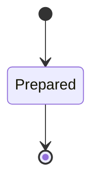
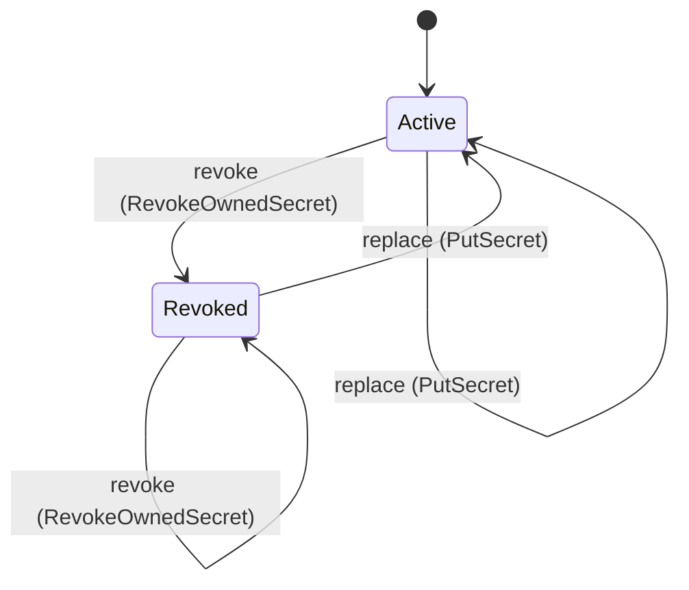

<!-- generated by secrets-docs, do not edit -->

# custody

Encrypted, tenant-scoped custody of secret values, their revocation and deletion, and atomic prepared mutation batches.

`secrets.custody` is one of secrets's bounded contexts. [All domains](./index.mdx).

## Types

### `DeleteMutation`

`secrets.custody.DeleteMutation` is a record of one field:

- `reference` — `secrets.custody.Reference`

### `Disclosure`

`secrets.custody.Disclosure` is one of `workload_only` and `user_revealable`.

### `Mutation`

`secrets.custody.Mutation` is one of two shapes, told apart by a `op` field — tagged, so a decoder never has to guess which branch it is reading:

- `delete` — `secrets.custody.DeleteMutation`
- `put` — `secrets.custody.PutMutation`

### `PutMutation`

`secrets.custody.PutMutation` is a record of one field:

- `secret` — `secrets.custody.SecretWrite`

### `Reference`

`secrets.custody.Reference` is a record of three fields:

- `tenant` — `String`
- `namespace` — `String`
- `key` — `String`

### `SecretWrite`

`secrets.custody.SecretWrite` is a record of five fields:

- `reference` — `secrets.custody.Reference`
- `owner_subject` — `String`
- `value` — `Bytes`
- `disclosure` — `Optional<secrets.custody.Disclosure>`, which may be absent
- `labels` — `Optional<Map<String, String>>`, which may be absent

## Entities

An entity is what this context is about: something with an identity that outlives any one request, a shape, and a lifecycle. The lifecycle is exhaustive — a move that is not drawn below is a move this specification does not permit, and that is the only way it says so. Every move is labelled with the command that takes it, because a move nothing can trigger is refused rather than drawn.

### `PreparedTransaction`

`secrets.custody.PreparedTransaction`.

An instance is identified by `transaction`, a `Uuid`. The name is part of the model and not a convention: a view projects the identity under that name, so a projection inventing its own would disagree with the view.

It holds:

- `tenant` — `String`
- `actor` — `String`
- `mutations` — `List<secrets.custody.Mutation>`
- `created_at` — `String`
- `expires_at` — `String`

It declares no relation to another entity, and no other entity names it.

No invariant is declared, so nothing here constrains an instance at rest.

Its state is a `secrets.custody.PreparedTransaction.State`, one of `Prepared`. That enum is synthesised from the lifecycle rather than declared beside it, so the states a view's filter compares and the states drawn below cannot disagree.

An instance is created in `Prepared`. `Prepared` is terminal, so an instance may rest there forever. That is declared rather than inferred from having no way out: an entity that cannot leave a state is either finished or stuck, and only its author knows which.

It declares no moves, so nothing changes its state once it exists.

It has one state, so there is no move to permit or to forbid.

No view projects it, so nothing outside this context is promised a way to observe one.

### `Secret`

`secrets.custody.Secret`.

An instance is identified by `reference`, a `secrets.custody.Reference`. The name is part of the model and not a convention: a view projects the identity under that name, so a projection inventing its own would disagree with the view.

It holds:

- `id` — `Uuid`
- `owner_subject` — `String`
- `disclosure` — `secrets.custody.Disclosure`
- `version` — `Integer`
- `labels` — `Map<String, String>`
- `value` — `Bytes`
- `created_at` — `String`
- `updated_at` — `String`

It declares no relation to another entity, and no other entity names it.

Every instance satisfies `version > 0` — a predicate over this entity's own fields, checked against them rather than stored as a sentence, so an invariant reading something the entity does not have is refused instead of documented.

Its state is a `secrets.custody.Secret.State`, one of `Active` and `Revoked`. That enum is synthesised from the lifecycle rather than declared beside it, so the states a view's filter compares and the states drawn below cannot disagree.

An instance is created in `Active`. No state is terminal: nothing in this lifecycle says an instance may stop moving.

Each move is taken by a declared command outcome, and a move nothing takes is refused as `missing_causation` rather than left as a state change nobody can trigger:

- `revoke` — taken by `secrets.custody.RevokeOwnedSecret` on its `revoked` outcome
- `replace` — taken by `secrets.custody.PutSecret` on its `replaced` outcome

An instance is brought into existence by `secrets.custody.PutSecret` on its `created` outcome.

Every ordered pair of these states is connected by some move, so this lifecycle forbids nothing.

Five views project it: [`ActiveSecrets`](#activesecrets), [`NamespaceSecrets`](#namespacesecrets), [`OwnedSecretDetail`](#ownedsecretdetail), [`OwnedSecrets`](#ownedsecrets) and [`SecretValue`](#secretvalue).

## Views

A view is what the outside world is promised it can observe. Each one says which instances it contains and how soon it reflects a command that has already returned, because "you can read this" without "how soon" is the promise every flaky suite is built on.

### `ActiveSecrets`

`secrets.custody.ActiveSecrets`.

It reads [`Secret`](#secret).

It contains the instances where `state == Active` holds, and only those — so an instance a caller cannot find in here has been filtered out rather than lost.

It exposes:

- `reference` — `secrets.custody.Reference`

It declares no order, so the rows come back in whatever order the implementation has, and two reads may disagree.

**Read-your-writes**: it is current the moment the command that changed it returns. A caller that has just created an invoice and cannot see it in here has been told a lie about what it did.

A generated scenario asserts it once, immediately after the command: a view promising this and not keeping the promise has to fail the suite rather than be retried until it passes.

### `NamespaceSecrets`

`secrets.custody.NamespaceSecrets`.

It reads [`Secret`](#secret).

It contains every instance of that entity: no filter narrows it, which is a decision somebody made and not a line somebody omitted.

It exposes:

- `id` — `Uuid`
- `reference` — `secrets.custody.Reference`
- `owner_subject` — `String`
- `disclosure` — `secrets.custody.Disclosure`
- `state` — `secrets.custody.Secret.State`
- `version` — `Integer`
- `labels` — `Map<String, String>`
- `created_at` — `String`
- `updated_at` — `String`

It declares no order, so the rows come back in whatever order the implementation has, and two reads may disagree.

**Read-your-writes**: it is current the moment the command that changed it returns. A caller that has just created an invoice and cannot see it in here has been told a lie about what it did.

A generated scenario asserts it once, immediately after the command: a view promising this and not keeping the promise has to fail the suite rather than be retried until it passes.

### `OwnedSecretDetail`

`secrets.custody.OwnedSecretDetail`.

It reads [`Secret`](#secret).

It contains every instance of that entity: no filter narrows it, which is a decision somebody made and not a line somebody omitted.

It exposes:

- `id` — `Uuid`
- `reference` — `secrets.custody.Reference`
- `owner_subject` — `String`
- `disclosure` — `secrets.custody.Disclosure`
- `state` — `secrets.custody.Secret.State`
- `version` — `Integer`
- `labels` — `Map<String, String>`
- `created_at` — `String`
- `updated_at` — `String`

It declares no order, so the rows come back in whatever order the implementation has, and two reads may disagree.

**Read-your-writes**: it is current the moment the command that changed it returns. A caller that has just created an invoice and cannot see it in here has been told a lie about what it did.

A generated scenario asserts it once, immediately after the command: a view promising this and not keeping the promise has to fail the suite rather than be retried until it passes.

### `OwnedSecrets`

`secrets.custody.OwnedSecrets`.

It reads [`Secret`](#secret).

It contains every instance of that entity: no filter narrows it, which is a decision somebody made and not a line somebody omitted.

It exposes:

- `id` — `Uuid`
- `reference` — `secrets.custody.Reference`
- `owner_subject` — `String`
- `disclosure` — `secrets.custody.Disclosure`
- `state` — `secrets.custody.Secret.State`
- `version` — `Integer`
- `labels` — `Map<String, String>`
- `created_at` — `String`
- `updated_at` — `String`

It declares no order, so the rows come back in whatever order the implementation has, and two reads may disagree.

**Read-your-writes**: it is current the moment the command that changed it returns. A caller that has just created an invoice and cannot see it in here has been told a lie about what it did.

A generated scenario asserts it once, immediately after the command: a view promising this and not keeping the promise has to fail the suite rather than be retried until it passes.

### `SecretValue`

`secrets.custody.SecretValue`.

It reads [`Secret`](#secret).

It contains the instances where `state == Active` holds, and only those — so an instance a caller cannot find in here has been filtered out rather than lost.

It exposes:

- `reference` — `secrets.custody.Reference`
- `version` — `Integer`
- `value` — `Bytes`

It declares no order, so the rows come back in whatever order the implementation has, and two reads may disagree.

**Read-your-writes**: it is current the moment the command that changed it returns. A caller that has just created an invoice and cannot see it in here has been told a lie about what it did.

A generated scenario asserts it once, immediately after the command: a view promising this and not keeping the promise has to fail the suite rather than be retried until it passes.

## Commands

### `AbortTransaction`

`secrets.custody.AbortTransaction`.

It takes:

- `tenant` — `String`
- `transaction` — `Uuid`

It has seven outcomes.

**`aborted`** — The batch is discarded without applying any mutation. The default branch, taken when no other outcome's condition matched. It removes the `secrets.custody.PreparedTransaction` its input names; no view shows it afterwards. The instance is the one named by the input field `transaction`. It emits `secrets.custody.TransactionAborted`. A test reaches it by constructing an input that satisfies no other outcome's condition.

**`not-found`** — Decided outside the input: no transaction with this id is prepared in the tenant, its `expires_at` column has passed, or its key is not in the keyring. No predicate over the input reaches this branch, and saying `when: false` instead would have claimed it is unreachable, which is a different and false statement. No entity in this specification changes. It reports `secrets.custody.NotFound`. It emits nothing. A test reaches it by injecting the declared fault, because no input can.

**`unauthorized`** — Decided outside the input: the bearer token is missing or refused by the Kubernetes authority. No predicate over the input reaches this branch, and saying `when: false` instead would have claimed it is unreachable, which is a different and false statement. No entity in this specification changes. It reports `secrets.custody.Unauthorized`. It emits nothing. A test reaches it by injecting the declared fault, because no input can.

**`forbidden`** — Decided outside the input: the grant's tenant is not the path tenant. No predicate over the input reaches this branch, and saying `when: false` instead would have claimed it is unreachable, which is a different and false statement. No entity in this specification changes. It reports `secrets.custody.Forbidden`. It emits nothing. A test reaches it by injecting the declared fault, because no input can.

**`missing-action`** — Decided outside the input: the grant lacks secret:abort, for a principal of the addressed tenant. No predicate over the input reaches this branch, and saying `when: false` instead would have claimed it is unreachable, which is a different and false statement. No entity in this specification changes. It reports `secrets.custody.Forbidden`. It emits nothing. A test reaches it by injecting the declared fault, because no input can.

**`unavailable`** — Decided outside the input: storage or TokenReview is unavailable. No predicate over the input reaches this branch, and saying `when: false` instead would have claimed it is unreachable, which is a different and false statement. No entity in this specification changes. It reports `secrets.custody.Unavailable`. It emits nothing. A test reaches it by injecting the declared fault, because no input can.

**`malformed-path`** — Decided outside the input: the transaction path segment is not a UUID. No predicate over the input reaches this branch, and saying `when: false` instead would have claimed it is unreachable, which is a different and false statement. No entity in this specification changes. It reports `secrets.custody.InvalidInput`. It emits nothing. A test reaches it by injecting the declared fault, because no input can.

### `CheckSecretExists`

`secrets.custody.CheckSecretExists`.

It takes:

- `reference` — `secrets.custody.Reference`

It has seven outcomes.

**`checked`** — The caller learns whether an Active secret is stored at the reference. The default branch, taken when no other outcome's condition matched. No entity in this specification changes. It emits `secrets.custody.SecretExistenceChecked`. A test reaches it by constructing an input that satisfies no other outcome's condition.

**`unauthorized`** — Decided outside the input: the bearer token is missing or refused by the Kubernetes authority. No predicate over the input reaches this branch, and saying `when: false` instead would have claimed it is unreachable, which is a different and false statement. No entity in this specification changes. It reports `secrets.custody.Unauthorized`. It emits nothing. A test reaches it by injecting the declared fault, because no input can.

**`forbidden`** — Decided outside the input: the grant's tenant is not reference.tenant. No predicate over the input reaches this branch, and saying `when: false` instead would have claimed it is unreachable, which is a different and false statement. No entity in this specification changes. It reports `secrets.custody.Forbidden`. It emits nothing. A test reaches it by injecting the declared fault, because no input can.

**`missing-action`** — Decided outside the input: the grant lacks secret:read_metadata, for a principal of the addressed tenant. No predicate over the input reaches this branch, and saying `when: false` instead would have claimed it is unreachable, which is a different and false statement. No entity in this specification changes. It reports `secrets.custody.Forbidden`. It emits nothing. A test reaches it by injecting the declared fault, because no input can.

**`unavailable`** — Decided outside the input: storage or TokenReview is unavailable. No predicate over the input reaches this branch, and saying `when: false` instead would have claimed it is unreachable, which is a different and false statement. No entity in this specification changes. It reports `secrets.custody.Unavailable`. It emits nothing. A test reaches it by injecting the declared fault, because no input can.

**`too-large`** — Decided outside the input: the request body is longer than 1048576 bytes. No predicate over the input reaches this branch, and saying `when: false` instead would have claimed it is unreachable, which is a different and false statement. No entity in this specification changes. It reports `secrets.custody.PayloadTooLarge`. It emits nothing. A test reaches it by injecting the declared fault, because no input can.

**`malformed-body`** — Decided outside the input: the request body is not JSON of the command's request shape. No predicate over the input reaches this branch, and saying `when: false` instead would have claimed it is unreachable, which is a different and false statement. No entity in this specification changes. It reports `secrets.custody.InvalidInput`. It emits nothing. A test reaches it by injecting the declared fault, because no input can.

### `CommitTransaction`

`secrets.custody.CommitTransaction`.

It takes:

- `tenant` — `String`
- `transaction` — `Uuid`

It has 10 outcomes.

**`committed`** — Every mutation in the batch is applied atomically and the batch is gone. The default branch, taken when no other outcome's condition matched. It removes the `secrets.custody.PreparedTransaction` its input names; no view shows it afterwards. The instance is the one named by the input field `transaction`. It emits `secrets.custody.TransactionCommitted`. A test reaches it by constructing an input that satisfies no other outcome's condition.

**`not-found`** — Decided outside the input: no unexpired transaction with this id is prepared in the tenant; a batch expires 600 seconds after it is prepared, by its `expires_at` or by the expiry sealed in its envelope. No predicate over the input reaches this branch, and saying `when: false` instead would have claimed it is unreachable, which is a different and false statement. No entity in this specification changes. It reports `secrets.custody.NotFound`. It emits nothing. A test reaches it by injecting the declared fault, because no input can.

**`delete-target-missing`** — Decided outside the input: a Delete mutation names a reference with no secret. No predicate over the input reaches this branch, and saying `when: false` instead would have claimed it is unreachable, which is a different and false statement. No entity in this specification changes. It reports `secrets.custody.NotFound`. It emits nothing. A test reaches it by injecting the declared fault, because no input can.

**`malformed-reference`** — Decided outside the input: a Put mutation's reference part is empty or contains NUL. No predicate over the input reaches this branch, and saying `when: false` instead would have claimed it is unreachable, which is a different and false statement. No entity in this specification changes. It reports `secrets.custody.InvalidInput`. It emits nothing. A test reaches it by injecting the declared fault, because no input can.

**`invalid-reference`** — Decided outside the input: a Put mutation's reference part is longer than 255 bytes, and none is empty or contains NUL. No predicate over the input reaches this branch, and saying `when: false` instead would have claimed it is unreachable, which is a different and false statement. No entity in this specification changes. It reports `secrets.custody.InvalidInput`. It emits nothing. A test reaches it by injecting the declared fault, because no input can.

**`unauthorized`** — Decided outside the input: the bearer token is missing or refused by the Kubernetes authority. No predicate over the input reaches this branch, and saying `when: false` instead would have claimed it is unreachable, which is a different and false statement. No entity in this specification changes. It reports `secrets.custody.Unauthorized`. It emits nothing. A test reaches it by injecting the declared fault, because no input can.

**`forbidden`** — Decided outside the input: the grant's tenant is not the path tenant. No predicate over the input reaches this branch, and saying `when: false` instead would have claimed it is unreachable, which is a different and false statement. No entity in this specification changes. It reports `secrets.custody.Forbidden`. It emits nothing. A test reaches it by injecting the declared fault, because no input can.

**`missing-action`** — Decided outside the input: the grant lacks secret:commit, for a principal of the addressed tenant. No predicate over the input reaches this branch, and saying `when: false` instead would have claimed it is unreachable, which is a different and false statement. No entity in this specification changes. It reports `secrets.custody.Forbidden`. It emits nothing. A test reaches it by injecting the declared fault, because no input can.

**`unavailable`** — Decided outside the input: storage, encryption or TokenReview is unavailable, or the batch envelope does not open under its tenant, id and actor. No predicate over the input reaches this branch, and saying `when: false` instead would have claimed it is unreachable, which is a different and false statement. No entity in this specification changes. It reports `secrets.custody.Unavailable`. It emits nothing. A test reaches it by injecting the declared fault, because no input can.

**`malformed-path`** — Decided outside the input: the transaction path segment is not a UUID. No predicate over the input reaches this branch, and saying `when: false` instead would have claimed it is unreachable, which is a different and false statement. No entity in this specification changes. It reports `secrets.custody.InvalidInput`. It emits nothing. A test reaches it by injecting the declared fault, because no input can.

### `DeleteOwnedSecret`

`secrets.custody.DeleteOwnedSecret`.

It takes:

- `reference` — `secrets.custody.Reference`

It has eight outcomes.

**`deleted`** — The secret and all its encrypted versions are gone. The default branch, taken when no other outcome's condition matched. It removes the `secrets.custody.Secret` its input names; no view shows it afterwards. The instance is the one named by the input field `reference`. It emits `secrets.custody.SecretDeleted`. A test reaches it by constructing an input that satisfies no other outcome's condition.

**`not-owned`** — Decided outside the input: no secret at the reference is owned by the calling subject. No predicate over the input reaches this branch, and saying `when: false` instead would have claimed it is unreachable, which is a different and false statement. No entity in this specification changes. It reports `secrets.custody.NotFound`. It emits nothing. A test reaches it by injecting the declared fault, because no input can.

**`unauthorized`** — Decided outside the input: the bearer token is missing or refused by the Identity authority. No predicate over the input reaches this branch, and saying `when: false` instead would have claimed it is unreachable, which is a different and false statement. No entity in this specification changes. It reports `secrets.custody.Unauthorized`. It emits nothing. A test reaches it by injecting the declared fault, because no input can.

**`forbidden`** — Decided outside the input: the caller's tenant is not reference.tenant. No predicate over the input reaches this branch, and saying `when: false` instead would have claimed it is unreachable, which is a different and false statement. No entity in this specification changes. It reports `secrets.custody.Forbidden`. It emits nothing. A test reaches it by injecting the declared fault, because no input can.

**`missing-action`** — Decided outside the input: the scope lacks secret:delete, for a principal of the addressed tenant. No predicate over the input reaches this branch, and saying `when: false` instead would have claimed it is unreachable, which is a different and false statement. No entity in this specification changes. It reports `secrets.custody.Forbidden`. It emits nothing. A test reaches it by injecting the declared fault, because no input can.

**`unavailable`** — Decided outside the input: storage or the Identity authority is unavailable. No predicate over the input reaches this branch, and saying `when: false` instead would have claimed it is unreachable, which is a different and false statement. No entity in this specification changes. It reports `secrets.custody.Unavailable`. It emits nothing. A test reaches it by injecting the declared fault, because no input can.

**`too-large`** — Decided outside the input: the request body is longer than 1048576 bytes. No predicate over the input reaches this branch, and saying `when: false` instead would have claimed it is unreachable, which is a different and false statement. No entity in this specification changes. It reports `secrets.custody.PayloadTooLarge`. It emits nothing. A test reaches it by injecting the declared fault, because no input can.

**`malformed-body`** — Decided outside the input: the request body is not JSON of the command's request shape. No predicate over the input reaches this branch, and saying `when: false` instead would have claimed it is unreachable, which is a different and false statement. No entity in this specification changes. It reports `secrets.custody.InvalidInput`. It emits nothing. A test reaches it by injecting the declared fault, because no input can.

### `DeleteSecret`

`secrets.custody.DeleteSecret`.

It takes:

- `reference` — `secrets.custody.Reference`
- `actor` — `Optional<String>`, which may be absent

It has eight outcomes.

**`deleted`** — The secret and all its encrypted versions are gone. The default branch, taken when no other outcome's condition matched. It removes the `secrets.custody.Secret` its input names; no view shows it afterwards. The instance is the one named by the input field `reference`. It emits `secrets.custody.SecretDeleted`. A test reaches it by constructing an input that satisfies no other outcome's condition.

**`not-found`** — Decided outside the input: no secret is stored at the reference. No predicate over the input reaches this branch, and saying `when: false` instead would have claimed it is unreachable, which is a different and false statement. No entity in this specification changes. It reports `secrets.custody.NotFound`. It emits nothing. A test reaches it by injecting the declared fault, because no input can.

**`unauthorized`** — Decided outside the input: the bearer token is missing or refused by the Kubernetes authority. No predicate over the input reaches this branch, and saying `when: false` instead would have claimed it is unreachable, which is a different and false statement. No entity in this specification changes. It reports `secrets.custody.Unauthorized`. It emits nothing. A test reaches it by injecting the declared fault, because no input can.

**`forbidden`** — Decided outside the input: the grant's tenant is not reference.tenant. No predicate over the input reaches this branch, and saying `when: false` instead would have claimed it is unreachable, which is a different and false statement. No entity in this specification changes. It reports `secrets.custody.Forbidden`. It emits nothing. A test reaches it by injecting the declared fault, because no input can.

**`missing-action`** — Decided outside the input: the grant lacks secret:delete, for a principal of the addressed tenant. No predicate over the input reaches this branch, and saying `when: false` instead would have claimed it is unreachable, which is a different and false statement. No entity in this specification changes. It reports `secrets.custody.Forbidden`. It emits nothing. A test reaches it by injecting the declared fault, because no input can.

**`unavailable`** — Decided outside the input: storage or TokenReview is unavailable. No predicate over the input reaches this branch, and saying `when: false` instead would have claimed it is unreachable, which is a different and false statement. No entity in this specification changes. It reports `secrets.custody.Unavailable`. It emits nothing. A test reaches it by injecting the declared fault, because no input can.

**`too-large`** — Decided outside the input: the request body is longer than 1048576 bytes. No predicate over the input reaches this branch, and saying `when: false` instead would have claimed it is unreachable, which is a different and false statement. No entity in this specification changes. It reports `secrets.custody.PayloadTooLarge`. It emits nothing. A test reaches it by injecting the declared fault, because no input can.

**`malformed-body`** — Decided outside the input: the request body is not JSON of the command's request shape. No predicate over the input reaches this branch, and saying `when: false` instead would have claimed it is unreachable, which is a different and false statement. No entity in this specification changes. It reports `secrets.custody.InvalidInput`. It emits nothing. A test reaches it by injecting the declared fault, because no input can.

### `ListNamespaceSecrets`

`secrets.custody.ListNamespaceSecrets`.

It takes:

- `tenant` — `String`
- `namespace` — `String`

It has seven outcomes.

**`listed`** — The caller receives the metadata of every secret in the namespace, in both states. The default branch, taken when no other outcome's condition matched. No entity in this specification changes. It emits `secrets.custody.NamespaceSecretsListed`. A test reaches it by constructing an input that satisfies no other outcome's condition.

**`unauthorized`** — Decided outside the input: the bearer token is missing or refused by the Kubernetes authority. No predicate over the input reaches this branch, and saying `when: false` instead would have claimed it is unreachable, which is a different and false statement. No entity in this specification changes. It reports `secrets.custody.Unauthorized`. It emits nothing. A test reaches it by injecting the declared fault, because no input can.

**`forbidden`** — Decided outside the input: the grant's tenant is not the requested tenant. No predicate over the input reaches this branch, and saying `when: false` instead would have claimed it is unreachable, which is a different and false statement. No entity in this specification changes. It reports `secrets.custody.Forbidden`. It emits nothing. A test reaches it by injecting the declared fault, because no input can.

**`missing-action`** — Decided outside the input: the grant lacks secret:list, for a principal of the addressed tenant. No predicate over the input reaches this branch, and saying `when: false` instead would have claimed it is unreachable, which is a different and false statement. No entity in this specification changes. It reports `secrets.custody.Forbidden`. It emits nothing. A test reaches it by injecting the declared fault, because no input can.

**`unavailable`** — Decided outside the input: storage or TokenReview is unavailable. No predicate over the input reaches this branch, and saying `when: false` instead would have claimed it is unreachable, which is a different and false statement. No entity in this specification changes. It reports `secrets.custody.Unavailable`. It emits nothing. A test reaches it by injecting the declared fault, because no input can.

**`too-large`** — Decided outside the input: the request body is longer than 1048576 bytes. No predicate over the input reaches this branch, and saying `when: false` instead would have claimed it is unreachable, which is a different and false statement. No entity in this specification changes. It reports `secrets.custody.PayloadTooLarge`. It emits nothing. A test reaches it by injecting the declared fault, because no input can.

**`malformed-body`** — Decided outside the input: the request body is not JSON of the command's request shape. No predicate over the input reaches this branch, and saying `when: false` instead would have claimed it is unreachable, which is a different and false statement. No entity in this specification changes. It reports `secrets.custody.InvalidInput`. It emits nothing. A test reaches it by injecting the declared fault, because no input can.

### `PrepareTransaction`

`secrets.custody.PrepareTransaction`.

It takes:

- `transaction` — `Uuid`
- `actor` — `String`
- `mutations` — `List<secrets.custody.Mutation>`

It has 11 outcomes.

**`prepared`** — The batch is held in the caller's tenant for later commit or abort, only as an AES-256-GCM envelope from the service keyring bound to the tenant, the transaction id and the actor, and for at most 600 seconds; expired batches of the tenant are removed. The default branch, taken when no other outcome's condition matched. It creates a `secrets.custody.PreparedTransaction`, which starts in `Prepared`. The new instance's identity is published as `transaction` on `secrets.custody.TransactionPrepared`. It emits `secrets.custody.TransactionPrepared`. It sets `tenant` from `implementation-generated`, `actor` from `input.actor` and `mutations` from `input.mutations`. A test reaches it by constructing an input that satisfies no other outcome's condition.

**`empty-batch`** — Taken when `mutations.count == 0` holds of the input. No entity in this specification changes. It reports `secrets.custody.InvalidInput`. It emits nothing. A test reaches it by constructing an input that satisfies that condition.

**`cross-tenant-batch`** — Eligible when mutations.count > 0; externally decided: a mutation names a tenant other than the caller's. No entity in this specification changes. It reports `secrets.custody.InvalidInput`. It emits nothing. A test reaches it by injecting the declared fault, because no input can.

**`duplicate`** — Eligible when mutations.count > 0; externally decided: a transaction with this id is already prepared in the tenant. No entity in this specification changes. It reports `secrets.custody.Conflict`. It emits nothing. A test reaches it by injecting the declared fault, because no input can.

**`unauthorized`** — Decided outside the input: the bearer token is missing or refused by the Kubernetes authority. No predicate over the input reaches this branch, and saying `when: false` instead would have claimed it is unreachable, which is a different and false statement. No entity in this specification changes. It reports `secrets.custody.Unauthorized`. It emits nothing. A test reaches it by injecting the declared fault, because no input can.

**`forbidden`** — Decided outside the input: the path names a tenant other than the grant's. No predicate over the input reaches this branch, and saying `when: false` instead would have claimed it is unreachable, which is a different and false statement. No entity in this specification changes. It reports `secrets.custody.Forbidden`. It emits nothing. A test reaches it by injecting the declared fault, because no input can.

**`missing-action`** — Decided outside the input: the grant lacks secret:prepare, for a principal of the addressed tenant. No predicate over the input reaches this branch, and saying `when: false` instead would have claimed it is unreachable, which is a different and false statement. No entity in this specification changes. It reports `secrets.custody.Forbidden`. It emits nothing. A test reaches it by injecting the declared fault, because no input can.

**`unavailable`** — Eligible when mutations.count > 0; externally decided: storage or TokenReview is unavailable. No entity in this specification changes. It reports `secrets.custody.Unavailable`. It emits nothing. A test reaches it by injecting the declared fault, because no input can.

**`too-large`** — Decided outside the input: the request body is longer than 1048576 bytes. No predicate over the input reaches this branch, and saying `when: false` instead would have claimed it is unreachable, which is a different and false statement. No entity in this specification changes. It reports `secrets.custody.PayloadTooLarge`. It emits nothing. A test reaches it by injecting the declared fault, because no input can.

**`malformed-body`** — Decided outside the input: the request body is not JSON of the command's request shape. No predicate over the input reaches this branch, and saying `when: false` instead would have claimed it is unreachable, which is a different and false statement. No entity in this specification changes. It reports `secrets.custody.InvalidInput`. It emits nothing. A test reaches it by injecting the declared fault, because no input can.

**`malformed-path`** — Decided outside the input: the transaction path segment is not a UUID. No predicate over the input reaches this branch, and saying `when: false` instead would have claimed it is unreachable, which is a different and false statement. No entity in this specification changes. It reports `secrets.custody.InvalidInput`. It emits nothing. A test reaches it by injecting the declared fault, because no input can.

### `PutSecret`

`secrets.custody.PutSecret`.

It takes:

- `reference` — `secrets.custody.Reference`
- `owner_subject` — `String`
- `value` — `Bytes`
- `disclosure` — `Optional<secrets.custody.Disclosure>`, which may be absent
- `labels` — `Optional<Map<String, String>>`, which may be absent

It has 10 outcomes.

**`created`** — A secret exists at the reference, Active, version 1. Decided outside the input: no secret is stored at the reference. No predicate over the input reaches this branch, and saying `when: false` instead would have claimed it is unreachable, which is a different and false statement. It creates a `secrets.custody.Secret`, which starts in `Active`. The new instance's identity is published as `reference` on `secrets.custody.SecretPut`. It emits `secrets.custody.SecretPut`. It sets `id` from `implementation-generated`, `owner_subject` from `input.owner_subject`, `disclosure` from `input.disclosure`, converted because An absent disclosure is `workload_only` (#[serde(default = "workload_only")], crates/secrets-core/src/lib.rs:52-53)., `version` from `"1"`, `labels` from `input.labels`, converted because Absent labels are the empty map (#[serde(default)], crates/secrets-core/src/lib.rs:54-55)., `value` from `input.value`, `created_at` from `implementation-generated` and `updated_at` from `implementation-generated`. A test reaches it by injecting the declared fault, because no input can.

**`replaced`** — The secret holds a new current version and is Active again, including after a revoke. The default branch, taken when no other outcome's condition matched. It moves a `secrets.custody.Secret` from `Active` and `Revoked` to `Active`, along the declared move `replace`. The instance is the one named by the input field `reference`. It emits `secrets.custody.SecretPut`. It sets `owner_subject` from `input.owner_subject`, `disclosure` from `input.disclosure`, converted because An absent disclosure is `workload_only` (#[serde(default = "workload_only")], crates/secrets-core/src/lib.rs:52-53)., `version` from `its previous value plus 1`, `labels` from `input.labels`, converted because Absent labels are the empty map (#[serde(default)], crates/secrets-core/src/lib.rs:54-55)., `value` from `input.value` and `updated_at` from `implementation-generated`. A test reaches it by constructing an input that satisfies no other outcome's condition.

**`malformed-reference`** — Taken when `(reference.tenant.count == 0 or reference.namespace.count == 0 or reference.key.count == 0 or reference.tenant contains "\0" or reference.namespace contains "\0" or reference.key contains "\0")` holds of the input. No entity in this specification changes. It reports `secrets.custody.InvalidInput`. It emits nothing. A test reaches it by constructing an input that satisfies that condition.

**`invalid-reference`** — Eligible when (reference.key.count >= 256 or reference.tenant.count > 63 or reference.namespace.count > 63 or reference.key.count > 63); externally decided: a reference part is longer than 255 bytes. No entity in this specification changes. It reports `secrets.custody.InvalidInput`. It emits nothing. A test reaches it by injecting the declared fault, because no input can.

**`unauthorized`** — Decided outside the input: the bearer token is missing or refused by the Kubernetes authority. No predicate over the input reaches this branch, and saying `when: false` instead would have claimed it is unreachable, which is a different and false statement. No entity in this specification changes. It reports `secrets.custody.Unauthorized`. It emits nothing. A test reaches it by injecting the declared fault, because no input can.

**`forbidden`** — Decided outside the input: the grant's tenant is not reference.tenant. No predicate over the input reaches this branch, and saying `when: false` instead would have claimed it is unreachable, which is a different and false statement. No entity in this specification changes. It reports `secrets.custody.Forbidden`. It emits nothing. A test reaches it by injecting the declared fault, because no input can.

**`missing-action`** — Decided outside the input: the grant lacks secret:write, for a principal of the addressed tenant. No predicate over the input reaches this branch, and saying `when: false` instead would have claimed it is unreachable, which is a different and false statement. No entity in this specification changes. It reports `secrets.custody.Forbidden`. It emits nothing. A test reaches it by injecting the declared fault, because no input can.

**`unavailable`** — Decided outside the input: storage, encryption or TokenReview is unavailable. No predicate over the input reaches this branch, and saying `when: false` instead would have claimed it is unreachable, which is a different and false statement. No entity in this specification changes. It reports `secrets.custody.Unavailable`. It emits nothing. A test reaches it by injecting the declared fault, because no input can.

**`too-large`** — Decided outside the input: the request body is longer than 1048576 bytes. No predicate over the input reaches this branch, and saying `when: false` instead would have claimed it is unreachable, which is a different and false statement. No entity in this specification changes. It reports `secrets.custody.PayloadTooLarge`. It emits nothing. A test reaches it by injecting the declared fault, because no input can.

**`malformed-body`** — Decided outside the input: the request body is not JSON of the command's request shape. No predicate over the input reaches this branch, and saying `when: false` instead would have claimed it is unreachable, which is a different and false statement. No entity in this specification changes. It reports `secrets.custody.InvalidInput`. It emits nothing. A test reaches it by injecting the declared fault, because no input can.

### `ReadSecretValue`

`secrets.custody.ReadSecretValue`.

It takes:

- `reference` — `secrets.custody.Reference`

It has eight outcomes.

**`read`** — The caller receives the current version's value and metadata. The default branch, taken when no other outcome's condition matched. No entity in this specification changes. It emits `secrets.custody.SecretValueRead`. A test reaches it by constructing an input that satisfies no other outcome's condition.

**`not-found`** — Decided outside the input: no Active secret is stored at the reference. No predicate over the input reaches this branch, and saying `when: false` instead would have claimed it is unreachable, which is a different and false statement. No entity in this specification changes. It reports `secrets.custody.NotFound`. It emits nothing. A test reaches it by injecting the declared fault, because no input can.

**`unauthorized`** — Decided outside the input: the bearer token is missing or refused by the Kubernetes authority. No predicate over the input reaches this branch, and saying `when: false` instead would have claimed it is unreachable, which is a different and false statement. No entity in this specification changes. It reports `secrets.custody.Unauthorized`. It emits nothing. A test reaches it by injecting the declared fault, because no input can.

**`forbidden`** — Decided outside the input: the grant's tenant is not reference.tenant. No predicate over the input reaches this branch, and saying `when: false` instead would have claimed it is unreachable, which is a different and false statement. No entity in this specification changes. It reports `secrets.custody.Forbidden`. It emits nothing. A test reaches it by injecting the declared fault, because no input can.

**`missing-action`** — Decided outside the input: the grant lacks secret:read_value, for a principal of the addressed tenant. No predicate over the input reaches this branch, and saying `when: false` instead would have claimed it is unreachable, which is a different and false statement. No entity in this specification changes. It reports `secrets.custody.Forbidden`. It emits nothing. A test reaches it by injecting the declared fault, because no input can.

**`unavailable`** — Decided outside the input: storage, decryption or TokenReview is unavailable. No predicate over the input reaches this branch, and saying `when: false` instead would have claimed it is unreachable, which is a different and false statement. No entity in this specification changes. It reports `secrets.custody.Unavailable`. It emits nothing. A test reaches it by injecting the declared fault, because no input can.

**`too-large`** — Decided outside the input: the request body is longer than 1048576 bytes. No predicate over the input reaches this branch, and saying `when: false` instead would have claimed it is unreachable, which is a different and false statement. No entity in this specification changes. It reports `secrets.custody.PayloadTooLarge`. It emits nothing. A test reaches it by injecting the declared fault, because no input can.

**`malformed-body`** — Decided outside the input: the request body is not JSON of the command's request shape. No predicate over the input reaches this branch, and saying `when: false` instead would have claimed it is unreachable, which is a different and false statement. No entity in this specification changes. It reports `secrets.custody.InvalidInput`. It emits nothing. A test reaches it by injecting the declared fault, because no input can.

### `RevokeOwnedSecret`

`secrets.custody.RevokeOwnedSecret`.

It takes:

- `reference` — `secrets.custody.Reference`

It has eight outcomes.

**`revoked`** — The secret is Revoked; workload get and exists no longer see it, list and detail still do. The default branch, taken when no other outcome's condition matched. It moves a `secrets.custody.Secret` from `Active` and `Revoked` to `Revoked`, along the declared move `revoke`. The instance is the one named by the input field `reference`. It emits `secrets.custody.SecretRevoked`. It sets `updated_at` from `implementation-generated`. A test reaches it by constructing an input that satisfies no other outcome's condition.

**`not-owned`** — Decided outside the input: no secret at the reference is owned by the calling subject. No predicate over the input reaches this branch, and saying `when: false` instead would have claimed it is unreachable, which is a different and false statement. No entity in this specification changes. It reports `secrets.custody.NotFound`. It emits nothing. A test reaches it by injecting the declared fault, because no input can.

**`unauthorized`** — Decided outside the input: the bearer token is missing or refused by the Identity authority. No predicate over the input reaches this branch, and saying `when: false` instead would have claimed it is unreachable, which is a different and false statement. No entity in this specification changes. It reports `secrets.custody.Unauthorized`. It emits nothing. A test reaches it by injecting the declared fault, because no input can.

**`forbidden`** — Decided outside the input: the caller's tenant is not reference.tenant. No predicate over the input reaches this branch, and saying `when: false` instead would have claimed it is unreachable, which is a different and false statement. No entity in this specification changes. It reports `secrets.custody.Forbidden`. It emits nothing. A test reaches it by injecting the declared fault, because no input can.

**`missing-action`** — Decided outside the input: the scope lacks secret:revoke, for a principal of the addressed tenant. No predicate over the input reaches this branch, and saying `when: false` instead would have claimed it is unreachable, which is a different and false statement. No entity in this specification changes. It reports `secrets.custody.Forbidden`. It emits nothing. A test reaches it by injecting the declared fault, because no input can.

**`unavailable`** — Decided outside the input: storage or the Identity authority is unavailable. No predicate over the input reaches this branch, and saying `when: false` instead would have claimed it is unreachable, which is a different and false statement. No entity in this specification changes. It reports `secrets.custody.Unavailable`. It emits nothing. A test reaches it by injecting the declared fault, because no input can.

**`too-large`** — Decided outside the input: the request body is longer than 1048576 bytes. No predicate over the input reaches this branch, and saying `when: false` instead would have claimed it is unreachable, which is a different and false statement. No entity in this specification changes. It reports `secrets.custody.PayloadTooLarge`. It emits nothing. A test reaches it by injecting the declared fault, because no input can.

**`malformed-body`** — Decided outside the input: the request body is not JSON of the command's request shape. No predicate over the input reaches this branch, and saying `when: false` instead would have claimed it is unreachable, which is a different and false statement. No entity in this specification changes. It reports `secrets.custody.InvalidInput`. It emits nothing. A test reaches it by injecting the declared fault, because no input can.

### `RewrapSecrets`

`secrets.custody.RewrapSecrets`.

It takes:

- `actor` — `String`

It has three outcomes.

**`rewrapped`** — Every stored version and every held prepared batch is wrapped by the active key. Decided outside the input: at least one stored version is wrapped by a key other than the operator's active key. No predicate over the input reaches this branch, and saying `when: false` instead would have claimed it is unreachable, which is a different and false statement. No entity in this specification changes. It emits `secrets.custody.SecretsRewrapped`. A test reaches it by injecting the declared fault, because no input can.

**`nothing-to-rewrap`** — Every stored version was already wrapped by the active key; nothing is re-encrypted and nothing is recorded. The default branch, taken when no other outcome's condition matched. No entity in this specification changes. It emits `secrets.custody.NothingRewrapped`. A test reaches it by constructing an input that satisfies no other outcome's condition.

**`failed`** — Decided outside the input: storage is unavailable, or a stored version or a held batch does not decrypt with the keyring. No predicate over the input reaches this branch, and saying `when: false` instead would have claimed it is unreachable, which is a different and false statement. No entity in this specification changes. It reports `secrets.custody.Unavailable`. It emits nothing. A test reaches it by injecting the declared fault, because no input can.

## Events

### `NamespaceSecretsListed`

`secrets.custody.NamespaceSecretsListed`.

It carries:

- `tenant` — `String`
- `namespace` — `String`

Emitted by `secrets.custody.ListNamespaceSecrets` on its `listed` outcome.

Nothing in this system reacts to it.

### `NothingRewrapped`

`secrets.custody.NothingRewrapped`.

It carries:

- `actor` — `String`

Emitted by `secrets.custody.RewrapSecrets` on its `nothing-to-rewrap` outcome.

Nothing in this system reacts to it.

### `SecretDeleted`

`secrets.custody.SecretDeleted`.

It carries:

- `reference` — `secrets.custody.Reference`

Emitted by `secrets.custody.DeleteOwnedSecret` on its `deleted` outcome.

Emitted by `secrets.custody.DeleteSecret` on its `deleted` outcome.

Nothing in this system reacts to it.

### `SecretExistenceChecked`

`secrets.custody.SecretExistenceChecked`.

It carries:

- `reference` — `secrets.custody.Reference`

Emitted by `secrets.custody.CheckSecretExists` on its `checked` outcome.

Nothing in this system reacts to it.

### `SecretPut`

`secrets.custody.SecretPut`.

It carries:

- `reference` — `secrets.custody.Reference`
- `owner_subject` — `String`

Emitted by `secrets.custody.PutSecret` on its `created` and `replaced` outcomes.

Nothing in this system reacts to it.

### `SecretRevoked`

`secrets.custody.SecretRevoked`.

It carries:

- `reference` — `secrets.custody.Reference`

Emitted by `secrets.custody.RevokeOwnedSecret` on its `revoked` outcome.

Nothing in this system reacts to it.

### `SecretValueRead`

`secrets.custody.SecretValueRead`.

It carries:

- `reference` — `secrets.custody.Reference`

Emitted by `secrets.custody.ReadSecretValue` on its `read` outcome.

Nothing in this system reacts to it.

### `SecretsRewrapped`

`secrets.custody.SecretsRewrapped`.

It carries:

- `actor` — `String`

Emitted by `secrets.custody.RewrapSecrets` on its `rewrapped` outcome.

Nothing in this system reacts to it.

### `TransactionAborted`

`secrets.custody.TransactionAborted`.

It carries:

- `tenant` — `String`
- `transaction` — `Uuid`

Emitted by `secrets.custody.AbortTransaction` on its `aborted` outcome.

Nothing in this system reacts to it.

### `TransactionCommitted`

`secrets.custody.TransactionCommitted`.

It carries:

- `tenant` — `String`
- `transaction` — `Uuid`

Emitted by `secrets.custody.CommitTransaction` on its `committed` outcome.

Nothing in this system reacts to it.

### `TransactionPrepared`

`secrets.custody.TransactionPrepared`.

It carries:

- `tenant` — `String`
- `transaction` — `Uuid`

Emitted by `secrets.custody.PrepareTransaction` on its `prepared` outcome.

Nothing in this system reacts to it.

## Errors

### `Conflict`

409. A prepared transaction already exists for this tenant and id; code `duplicate` (crates/secrets-postgres/src/lib.rs:305-311; crates/secrets-http/src/lib.rs:431).

It carries nothing beyond its name, so a caller can tell what went wrong and not which value caused it.

Reported by `secrets.custody.PrepareTransaction` on its `duplicate` outcome.

### `Forbidden`

403. The principal lacks the action (code `missing-action`), or its tenant differs from the addressed tenant (code `forbidden`) (crates/secrets-http/src/lib.rs:346-358).

It carries nothing beyond its name, so a caller can tell what went wrong and not which value caused it.

Reported by `secrets.custody.AbortTransaction` on its `forbidden` and `missing-action` outcomes.

Reported by `secrets.custody.CheckSecretExists` on its `forbidden` and `missing-action` outcomes.

Reported by `secrets.custody.CommitTransaction` on its `forbidden` and `missing-action` outcomes.

Reported by `secrets.custody.DeleteOwnedSecret` on its `forbidden` and `missing-action` outcomes.

Reported by `secrets.custody.DeleteSecret` on its `forbidden` and `missing-action` outcomes.

Reported by `secrets.custody.ListNamespaceSecrets` on its `forbidden` and `missing-action` outcomes.

Reported by `secrets.custody.PrepareTransaction` on its `forbidden` and `missing-action` outcomes.

Reported by `secrets.custody.PutSecret` on its `forbidden` and `missing-action` outcomes.

Reported by `secrets.custody.ReadSecretValue` on its `forbidden` and `missing-action` outcomes.

Reported by `secrets.custody.RevokeOwnedSecret` on its `forbidden` and `missing-action` outcomes.

### `InvalidInput`

400. A store input rule (codes `malformed-reference`, `invalid-reference`, `empty-batch`, `cross-tenant-batch`), a body that does not parse (`malformed-body`) or a path that does not parse (`malformed-path`) (crates/secrets-http/src/lib.rs:432-435, 485, 501).

It carries nothing beyond its name, so a caller can tell what went wrong and not which value caused it.

Reported by `secrets.custody.AbortTransaction` on its `malformed-path` outcome.

Reported by `secrets.custody.CheckSecretExists` on its `malformed-body` outcome.

Reported by `secrets.custody.CommitTransaction` on its `malformed-reference`, `invalid-reference` and `malformed-path` outcomes.

Reported by `secrets.custody.DeleteOwnedSecret` on its `malformed-body` outcome.

Reported by `secrets.custody.DeleteSecret` on its `malformed-body` outcome.

Reported by `secrets.custody.ListNamespaceSecrets` on its `malformed-body` outcome.

Reported by `secrets.custody.PrepareTransaction` on its `empty-batch`, `cross-tenant-batch`, `malformed-body` and `malformed-path` outcomes.

Reported by `secrets.custody.PutSecret` on its `malformed-reference`, `invalid-reference` and `malformed-body` outcomes.

Reported by `secrets.custody.ReadSecretValue` on its `malformed-body` outcome.

Reported by `secrets.custody.RevokeOwnedSecret` on its `malformed-body` outcome.

### `NotFound`

404. No record at the address (code `not-found`), on user routes no secret the caller owns (code `not-owned`), or a commit whose Delete names no secret (code `delete-target-missing`) (crates/secrets-http/src/lib.rs:308-324, 425-430; crates/secrets-postgres/src/lib.rs:352-360).

It carries nothing beyond its name, so a caller can tell what went wrong and not which value caused it.

Reported by `secrets.custody.AbortTransaction` on its `not-found` outcome.

Reported by `secrets.custody.CommitTransaction` on its `not-found` and `delete-target-missing` outcomes.

Reported by `secrets.custody.DeleteOwnedSecret` on its `not-owned` outcome.

Reported by `secrets.custody.DeleteSecret` on its `not-found` outcome.

Reported by `secrets.custody.ReadSecretValue` on its `not-found` outcome.

Reported by `secrets.custody.RevokeOwnedSecret` on its `not-owned` outcome.

### `PayloadTooLarge`

413. The request body exceeds 1 MiB (RequestBodyLimitLayer, crates/secrets-http/src/lib.rs:57); refused before the handler authenticates, by the layer from the declared length or by `JsonBody` from the bytes read, and answered in the refusal shape with code `too-large` (crates/secrets-http/src/lib.rs:59-60, 461-469, 482-484).

It carries nothing beyond its name, so a caller can tell what went wrong and not which value caused it.

Reported by `secrets.custody.CheckSecretExists` on its `too-large` outcome.

Reported by `secrets.custody.DeleteOwnedSecret` on its `too-large` outcome.

Reported by `secrets.custody.DeleteSecret` on its `too-large` outcome.

Reported by `secrets.custody.ListNamespaceSecrets` on its `too-large` outcome.

Reported by `secrets.custody.PrepareTransaction` on its `too-large` outcome.

Reported by `secrets.custody.PutSecret` on its `too-large` outcome.

Reported by `secrets.custody.ReadSecretValue` on its `too-large` outcome.

Reported by `secrets.custody.RevokeOwnedSecret` on its `too-large` outcome.

### `Unauthorized`

401. No bearer token, or the authority refused it; code `unauthorized` (crates/secrets-http/src/lib.rs:340-345, 439-444).

It carries nothing beyond its name, so a caller can tell what went wrong and not which value caused it.

Reported by `secrets.custody.AbortTransaction` on its `unauthorized` outcome.

Reported by `secrets.custody.CheckSecretExists` on its `unauthorized` outcome.

Reported by `secrets.custody.CommitTransaction` on its `unauthorized` outcome.

Reported by `secrets.custody.DeleteOwnedSecret` on its `unauthorized` outcome.

Reported by `secrets.custody.DeleteSecret` on its `unauthorized` outcome.

Reported by `secrets.custody.ListNamespaceSecrets` on its `unauthorized` outcome.

Reported by `secrets.custody.PrepareTransaction` on its `unauthorized` outcome.

Reported by `secrets.custody.PutSecret` on its `unauthorized` outcome.

Reported by `secrets.custody.ReadSecretValue` on its `unauthorized` outcome.

Reported by `secrets.custody.RevokeOwnedSecret` on its `unauthorized` outcome.

### `Unavailable`

503. Storage, crypto or authority unavailable; code `unavailable` (crates/secrets-http/src/lib.rs:436, 442).

It carries nothing beyond its name, so a caller can tell what went wrong and not which value caused it.

Reported by `secrets.custody.AbortTransaction` on its `unavailable` outcome.

Reported by `secrets.custody.CheckSecretExists` on its `unavailable` outcome.

Reported by `secrets.custody.CommitTransaction` on its `unavailable` outcome.

Reported by `secrets.custody.DeleteOwnedSecret` on its `unavailable` outcome.

Reported by `secrets.custody.DeleteSecret` on its `unavailable` outcome.

Reported by `secrets.custody.ListNamespaceSecrets` on its `unavailable` outcome.

Reported by `secrets.custody.PrepareTransaction` on its `unavailable` outcome.

Reported by `secrets.custody.PutSecret` on its `unavailable` outcome.

Reported by `secrets.custody.ReadSecretValue` on its `unavailable` outcome.

Reported by `secrets.custody.RevokeOwnedSecret` on its `unavailable` outcome.

Reported by `secrets.custody.RewrapSecrets` on its `failed` outcome.

## Actors

An actor is who may ask this context for something. Every grant below points at a command this specification declares — a grant is a resolved reference, so "may invoke" something nobody wrote is not a permission this model can express, and an authorisation that authorises nothing cannot ship quietly.

### `Operator`

`secrets.custody.Operator`.

It may invoke [`RewrapSecrets`](#rewrapsecrets).

### `User`

`secrets.custody.User`.

It may invoke [`DeleteOwnedSecret`](#deleteownedsecret) and [`RevokeOwnedSecret`](#revokeownedsecret).

### `Workload`

`secrets.custody.Workload`.

It may invoke [`AbortTransaction`](#aborttransaction), [`CheckSecretExists`](#checksecretexists), [`CommitTransaction`](#committransaction), [`DeleteSecret`](#deletesecret), [`ListNamespaceSecrets`](#listnamespacesecrets), [`PrepareTransaction`](#preparetransaction), [`PutSecret`](#putsecret) and [`ReadSecretValue`](#readsecretvalue).

## Type crossings

Types in this context that the specification permits to be used as another type, or the other way round. Nothing else crosses: two newtypes over the same primitive stay distinct until a line in the specification says otherwise.

**`Optional<secrets.custody.Disclosure>` may be used as `secrets.custody.Disclosure`**, because:

> An absent disclosure is `workload_only` (#[serde(default = "workload_only")], crates/secrets-core/src/lib.rs:52-53).

Every crossing in the system is on one page: [Type crossings](./crossings.md).

---

Generated from secrets v1 · model digest `a400890747eb193dcba0b845cca169bfb1ded00af40933596fb0f3cfe7dd593b` · contract digest `slice-sha256/2:eb2b2fa175f064351382d36e78be9b9ecc892f199a15384ba55ef727bd14fec7`. Do not edit this file; change the specification and regenerate it with `task docs-generate`.
