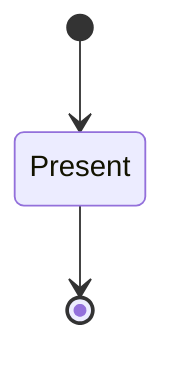
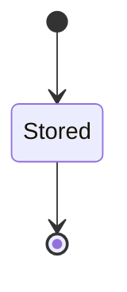

<!-- generated by secrets-docs, do not edit -->

# storage

Named, scoped secrets stored through exactly one backend per namespace, with every command decided by an authorizer before any backend call.

`secrets.storage` is one of secrets's bounded contexts. [All domains](./index.mdx).

## Types

### `Action`

`secrets.storage.Action` is one of `read`, `write`, `delete`, `list` and `manage-namespace`.

### `Address`

`secrets.storage.Address` is a record of two fields:

- `scope` — `secrets.storage.Scope`
- `name` — `secrets.storage.SecretName`

### `BackendKind`

`secrets.storage.BackendKind` is one of `keychain`, `onepassword` and `remote`.

### `BackendRef`

`secrets.storage.BackendRef` is a record of two fields:

- `kind` — `secrets.storage.BackendKind`
- `label` — `secrets.storage.ScopeName`

### `Capability`

`secrets.storage.Capability` is one of `read`, `write`, `delete` and `list`.

### `NamespaceKey`

`secrets.storage.NamespaceKey` is a record of two fields:

- `tenant` — `secrets.storage.ScopeName`
- `namespace` — `secrets.storage.ScopeName`

### `Scope`

`secrets.storage.Scope` is a record of three fields:

- `tenant` — `secrets.storage.ScopeName`
- `namespace` — `secrets.storage.ScopeName`
- `user` — `secrets.storage.ScopeName`

### `ScopeName`

`secrets.storage.ScopeName` wraps `String` and is not interchangeable with one: the whole value of naming it separately is the crossings the model then refuses. Its characters are drawn from `abcdefghijklmnopqrstuvwxyz0123456789._-`.

### `SecretName`

`secrets.storage.SecretName` wraps `String` and is not interchangeable with one: the whole value of naming it separately is the crossings the model then refuses. Its characters are drawn from `abcdefghijklmnopqrstuvwxyz0123456789._-/`.

One of the types above is reached by nothing else in this system: `secrets.storage.Action`. No entity, view, command, event, error or crossing names it, so it is either vocabulary something outside this specification uses or a leftover — and only a person can tell which.

## Entities

An entity is what this context is about: something with an identity that outlives any one request, a shape, and a lifecycle. The lifecycle is exhaustive — a move that is not drawn below is a move this specification does not permit, and that is the only way it says so. Every move is labelled with the command that takes it, because a move nothing can trigger is refused rather than drawn.

### `Backend`

`secrets.storage.Backend`.

An instance is identified by `backend`, a `secrets.storage.BackendRef`. The name is part of the model and not a convention: a view projects the identity under that name, so a projection inventing its own would disagree with the view.

It holds:

- `capabilities` — `List<secrets.storage.Capability>`

It declares no relation to another entity, and no other entity names it.

Every instance satisfies `(backend.kind != onepassword or (exists c in capabilities: (c == read) and not (exists c in capabilities: ((c == write or c == delete or c == list)))))` and `(backend.kind == onepassword or (exists c in capabilities: (c == read) and exists c in capabilities: (c == write) and exists c in capabilities: (c == delete) and exists c in capabilities: (c == list)))` — a predicate over this entity's own fields, checked against them rather than stored as a sentence, so an invariant reading something the entity does not have is refused instead of documented.

Its state is a `secrets.storage.Backend.State`, one of `Present`. That enum is synthesised from the lifecycle rather than declared beside it, so the states a view's filter compares and the states drawn below cannot disagree.

An instance is created in `Present`. `Present` is terminal, so an instance may rest there forever. That is declared rather than inferred from having no way out: an entity that cannot leave a state is either finished or stuck, and only its author knows which.

It declares no moves, so nothing changes its state once it exists.

It has one state, so there is no move to permit or to forbid.

No view projects it, so nothing outside this context is promised a way to observe one.

### `Binding`

`secrets.storage.Binding`.

An instance is identified by `address`, a `secrets.storage.Address`. The name is part of the model and not a convention: a view projects the identity under that name, so a projection inventing its own would disagree with the view.

It holds:

- `locator` — `String`

It declares no relation to another entity, and no other entity names it.

No invariant is declared, so nothing here constrains an instance at rest.

Its state is a `secrets.storage.Binding.State`, one of `Present`. That enum is synthesised from the lifecycle rather than declared beside it, so the states a view's filter compares and the states drawn below cannot disagree.

An instance is created in `Present`. `Present` is terminal, so an instance may rest there forever. That is declared rather than inferred from having no way out: an entity that cannot leave a state is either finished or stuck, and only its author knows which.

It declares no moves, so nothing changes its state once it exists.

It has one state, so there is no move to permit or to forbid.

No view projects it, so nothing outside this context is promised a way to observe one.

### `Namespace`

`secrets.storage.Namespace`.

An instance is identified by `namespace`, a `secrets.storage.NamespaceKey`. The name is part of the model and not a convention: a view projects the identity under that name, so a projection inventing its own would disagree with the view.

It holds:

- `mount` — `Optional<secrets.storage.BackendRef>`, which may be absent

It references at most one [`Backend`](#backend), as `mount`, carried by `Namespace.mount`.

No invariant is declared, so nothing here constrains an instance at rest.

Its state is a `secrets.storage.Namespace.State`, one of `Present`. That enum is synthesised from the lifecycle rather than declared beside it, so the states a view's filter compares and the states drawn below cannot disagree.

An instance is created in `Present`. `Present` is terminal, so an instance may rest there forever. That is declared rather than inferred from having no way out: an entity that cannot leave a state is either finished or stuck, and only its author knows which.

It declares no moves, so nothing changes its state once it exists.

It has one state, so there is no move to permit or to forbid.

One view projects it: [`Namespaces`](#namespaces).

### `Secret`

`secrets.storage.Secret`.

An instance is identified by `address`, a `secrets.storage.Address`. The name is part of the model and not a convention: a view projects the identity under that name, so a projection inventing its own would disagree with the view.

It holds:

- `version` — `Optional<String>`, which may be absent

It declares no relation to another entity, and no other entity names it.

No invariant is declared, so nothing here constrains an instance at rest.

Its state is a `secrets.storage.Secret.State`, one of `Stored`. That enum is synthesised from the lifecycle rather than declared beside it, so the states a view's filter compares and the states drawn below cannot disagree.

An instance is created in `Stored`. `Stored` is terminal, so an instance may rest there forever. That is declared rather than inferred from having no way out: an entity that cannot leave a state is either finished or stuck, and only its author knows which.

It declares no moves, so nothing changes its state once it exists.

It has one state, so there is no move to permit or to forbid.

One view projects it: [`SecretMetadata`](#secretmetadata).

### `Tenant`

`secrets.storage.Tenant`.

An instance is identified by `tenant`, a `secrets.storage.ScopeName`. The name is part of the model and not a convention: a view projects the identity under that name, so a projection inventing its own would disagree with the view.

It holds nothing beyond its identity and its state.

It declares no relation to another entity, and no other entity names it.

No invariant is declared, so nothing here constrains an instance at rest.

Its state is a `secrets.storage.Tenant.State`, one of `Present`. That enum is synthesised from the lifecycle rather than declared beside it, so the states a view's filter compares and the states drawn below cannot disagree.

An instance is created in `Present`. `Present` is terminal, so an instance may rest there forever. That is declared rather than inferred from having no way out: an entity that cannot leave a state is either finished or stuck, and only its author knows which.

It declares no moves, so nothing changes its state once it exists.

It has one state, so there is no move to permit or to forbid.

No view projects it, so nothing outside this context is promised a way to observe one.

## Views

A view is what the outside world is promised it can observe. Each one says which instances it contains and how soon it reflects a command that has already returned, because "you can read this" without "how soon" is the promise every flaky suite is built on.

### `Namespaces`

`secrets.storage.Namespaces`.

It reads [`Namespace`](#namespace).

It contains every instance of that entity: no filter narrows it, which is a decision somebody made and not a line somebody omitted.

It exposes:

- `namespace` — `secrets.storage.NamespaceKey`
- `mount` — `Optional<secrets.storage.BackendRef>`, which may be absent
- `state` — `secrets.storage.Namespace.State`

It declares no order, so the rows come back in whatever order the implementation has, and two reads may disagree.

**Read-your-writes**: it is current the moment the command that changed it returns. A caller that has just created an invoice and cannot see it in here has been told a lie about what it did.

A generated scenario asserts it once, immediately after the command: a view promising this and not keeping the promise has to fail the suite rather than be retried until it passes.

### `SecretMetadata`

`secrets.storage.SecretMetadata`.

It reads [`Secret`](#secret).

It contains every instance of that entity: no filter narrows it, which is a decision somebody made and not a line somebody omitted.

It exposes:

- `address` — `secrets.storage.Address`
- `version` — `Optional<String>`, which may be absent
- `state` — `secrets.storage.Secret.State`

It declares no order, so the rows come back in whatever order the implementation has, and two reads may disagree.

**Read-your-writes**: it is current the moment the command that changed it returns. A caller that has just created an invoice and cannot see it in here has been told a lie about what it did.

A generated scenario asserts it once, immediately after the command: a view promising this and not keeping the promise has to fail the suite rather than be retried until it passes.

## Commands

### `AddNamespace`

`secrets.storage.AddNamespace`.

It takes:

- `namespace` — `secrets.storage.NamespaceKey`
- `mount` — `Optional<secrets.storage.BackendRef>`, which may be absent

It has seven outcomes.

**`denied`** — Taken when `namespace.tenant != default` holds of the input. No entity in this specification changes. It reports `secrets.storage.Denied`. It emits nothing. A test reaches it by constructing an input that satisfies that condition.

**`name-too-long`** — Taken when `(namespace.tenant == default and namespace.namespace.count > 64)` holds of the input. No entity in this specification changes. It reports `secrets.storage.InvalidName`. It emits nothing. A test reaches it by constructing an input that satisfies that condition.

**`invalid-name`** — Decided outside the input: the namespace name has a first character outside [a-z0-9]. No predicate over the input reaches this branch, and saying `when: false` instead would have claimed it is unreachable, which is a different and false statement. No entity in this specification changes. It reports `secrets.storage.InvalidName`. It emits nothing. A test reaches it by injecting the declared fault, because no input can.

**`exists`** — Decided outside the input: a namespace of this name already exists in the tenant. No predicate over the input reaches this branch, and saying `when: false` instead would have claimed it is unreachable, which is a different and false statement. No entity in this specification changes. It reports `secrets.storage.Conflict`. It emits nothing. A test reaches it by injecting the declared fault, because no input can.

**`no-backend`** — Decided outside the input: the mount names a backend that is not configured. No predicate over the input reaches this branch, and saying `when: false` instead would have claimed it is unreachable, which is a different and false statement. No entity in this specification changes. It reports `secrets.storage.NotFound`. It emits nothing. A test reaches it by injecting the declared fault, because no input can.

**`added`** — The namespace exists in the tenant, with the given mount or the default keychain one. The default branch, taken when no other outcome's condition matched. It creates a `secrets.storage.Namespace`, which starts in `Present`. The new instance's identity is published as `namespace` on `secrets.storage.NamespaceAdded`. It emits `secrets.storage.NamespaceAdded`. It sets `mount` from `input.mount`. A test reaches it by constructing an input that satisfies no other outcome's condition.

**`unavailable`** — Decided outside the input: the namespace configuration store could not be reached. No predicate over the input reaches this branch, and saying `when: false` instead would have claimed it is unreachable, which is a different and false statement. No entity in this specification changes. It reports `secrets.storage.Unavailable`. It emits nothing. A test reaches it by injecting the declared fault, because no input can.

### `Bind`

`secrets.storage.Bind`.

It takes:

- `address` — `secrets.storage.Address`
- `locator` — `String`

It has eight outcomes.

**`denied`** — Taken when `address.scope.tenant != default` holds of the input. No entity in this specification changes. It reports `secrets.storage.Denied`. It emits nothing. A test reaches it by constructing an input that satisfies that condition.

**`denied-user`** — Taken when `(address.scope.tenant == default and address.scope.user != default)` holds of the input. No entity in this specification changes. It reports `secrets.storage.Denied`. It emits nothing. A test reaches it by constructing an input that satisfies that condition.

**`name-too-long`** — Taken when `(address.scope.tenant == default and address.scope.user == default and address.name.count > 128)` holds of the input. No entity in this specification changes. It reports `secrets.storage.InvalidName`. It emits nothing. A test reaches it by constructing an input that satisfies that condition.

**`invalid-name`** — Decided outside the input: a name has an empty segment, a segment not starting with [a-z0-9], or a segment over 64 bytes. No predicate over the input reaches this branch, and saying `when: false` instead would have claimed it is unreachable, which is a different and false statement. No entity in this specification changes. It reports `secrets.storage.InvalidName`. It emits nothing. A test reaches it by injecting the declared fault, because no input can.

**`no-namespace`** — Decided outside the input: no namespace of this name exists in the tenant. No predicate over the input reaches this branch, and saying `when: false` instead would have claimed it is unreachable, which is a different and false statement. No entity in this specification changes. It reports `secrets.storage.NotFound`. It emits nothing. A test reaches it by injecting the declared fault, because no input can.

**`already-bound`** — Decided outside the input: the address already has a binding. No predicate over the input reaches this branch, and saying `when: false` instead would have claimed it is unreachable, which is a different and false statement. No entity in this specification changes. It reports `secrets.storage.Conflict`. It emits nothing. A test reaches it by injecting the declared fault, because no input can.

**`bound`** — The address resolves to the locator in the namespace's backend. The default branch, taken when no other outcome's condition matched. It creates a `secrets.storage.Binding`, which starts in `Present`. The new instance's identity is published as `address` on `secrets.storage.NameBound`. It emits `secrets.storage.NameBound`. It sets `locator` from `input.locator`. A test reaches it by constructing an input that satisfies no other outcome's condition.

**`unavailable`** — Decided outside the input: the namespace configuration store could not be reached. No predicate over the input reaches this branch, and saying `when: false` instead would have claimed it is unreachable, which is a different and false statement. No entity in this specification changes. It reports `secrets.storage.Unavailable`. It emits nothing. A test reaches it by injecting the declared fault, because no input can.

### `Delete`

`secrets.storage.Delete`.

It takes:

- `address` — `secrets.storage.Address`

It has nine outcomes.

**`denied`** — Decided by the authorizer before any backend call. Taken when `address.scope.tenant != default` holds of the input. No entity in this specification changes. It reports `secrets.storage.Denied`. It emits nothing. A test reaches it by constructing an input that satisfies that condition.

**`denied-user`** — Decided by the authorizer before any backend call. Taken when `(address.scope.tenant == default and address.scope.user != default)` holds of the input. No entity in this specification changes. It reports `secrets.storage.Denied`. It emits nothing. A test reaches it by constructing an input that satisfies that condition.

**`name-too-long`** — Taken when `(address.scope.tenant == default and address.scope.user == default and address.name.count > 128)` holds of the input. No entity in this specification changes. It reports `secrets.storage.InvalidName`. It emits nothing. A test reaches it by constructing an input that satisfies that condition.

**`invalid-name`** — Decided outside the input: a name has an empty segment, a segment not starting with [a-z0-9], or a segment over 64 bytes. No predicate over the input reaches this branch, and saying `when: false` instead would have claimed it is unreachable, which is a different and false statement. No entity in this specification changes. It reports `secrets.storage.InvalidName`. It emits nothing. A test reaches it by injecting the declared fault, because no input can.

**`unresolved`** — Decided outside the input: the namespace has no mount, or the backend requires a binding and the name has none; no backend is called. No predicate over the input reaches this branch, and saying `when: false` instead would have claimed it is unreachable, which is a different and false statement. No entity in this specification changes. It reports `secrets.storage.NotFound`. It emits nothing. A test reaches it by injecting the declared fault, because no input can.

**`unsupported`** — Decided outside the input: the resolved backend lacks the delete capability (onepassword). No predicate over the input reaches this branch, and saying `when: false` instead would have claimed it is unreachable, which is a different and false statement. No entity in this specification changes. It reports `secrets.storage.Unsupported`. It emits nothing. A test reaches it by injecting the declared fault, because no input can.

**`not-found`** — Decided outside the input: the backend holds no secret at the address. No predicate over the input reaches this branch, and saying `when: false` instead would have claimed it is unreachable, which is a different and false statement. No entity in this specification changes. It reports `secrets.storage.NotFound`. It emits nothing. A test reaches it by injecting the declared fault, because no input can.

**`deleted`** — The backend no longer holds a secret at the address; any binding stays. The default branch, taken when no other outcome's condition matched. No entity in this specification changes. It emits `secrets.storage.SecretDeleted`. A test reaches it by constructing an input that satisfies no other outcome's condition.

**`unavailable`** — Decided outside the input: the resolved backend could not be reached or did not answer. No predicate over the input reaches this branch, and saying `when: false` instead would have claimed it is unreachable, which is a different and false statement. No entity in this specification changes. It reports `secrets.storage.Unavailable`. It emits nothing. A test reaches it by injecting the declared fault, because no input can.

### `ListMetadata`

`secrets.storage.ListMetadata`.

It takes:

- `scope` — `secrets.storage.Scope`

It has six outcomes.

**`denied`** — Decided by the authorizer before any backend call. Taken when `scope.tenant != default` holds of the input. No entity in this specification changes. It reports `secrets.storage.Denied`. It emits nothing. A test reaches it by constructing an input that satisfies that condition.

**`denied-user`** — Decided by the authorizer before any backend call. Taken when `(scope.tenant == default and scope.user != default)` holds of the input. No entity in this specification changes. It reports `secrets.storage.Denied`. It emits nothing. A test reaches it by constructing an input that satisfies that condition.

**`unresolved`** — Decided outside the input: the namespace has no mount; no backend is called. No predicate over the input reaches this branch, and saying `when: false` instead would have claimed it is unreachable, which is a different and false statement. No entity in this specification changes. It reports `secrets.storage.NotFound`. It emits nothing. A test reaches it by injecting the declared fault, because no input can.

**`unsupported`** — Decided outside the input: the resolved backend lacks the list capability (onepassword). No predicate over the input reaches this branch, and saying `when: false` instead would have claimed it is unreachable, which is a different and false statement. No entity in this specification changes. It reports `secrets.storage.Unsupported`. It emits nothing. A test reaches it by injecting the declared fault, because no input can.

**`listed`** — The caller holds the metadata of every secret in the scope. The default branch, taken when no other outcome's condition matched. No entity in this specification changes. It emits `secrets.storage.MetadataListed`. A test reaches it by constructing an input that satisfies no other outcome's condition.

**`unavailable`** — Decided outside the input: the resolved backend could not be reached or did not answer. No predicate over the input reaches this branch, and saying `when: false` instead would have claimed it is unreachable, which is a different and false statement. No entity in this specification changes. It reports `secrets.storage.Unavailable`. It emits nothing. A test reaches it by injecting the declared fault, because no input can.

### `Read`

`secrets.storage.Read`.

It takes:

- `address` — `secrets.storage.Address`

It has eight outcomes.

**`denied`** — Decided by the authorizer before any backend call. Taken when `address.scope.tenant != default` holds of the input. No entity in this specification changes. It reports `secrets.storage.Denied`. It emits nothing. A test reaches it by constructing an input that satisfies that condition.

**`denied-user`** — Decided by the authorizer before any backend call. Taken when `(address.scope.tenant == default and address.scope.user != default)` holds of the input. No entity in this specification changes. It reports `secrets.storage.Denied`. It emits nothing. A test reaches it by constructing an input that satisfies that condition.

**`name-too-long`** — Taken when `(address.scope.tenant == default and address.scope.user == default and address.name.count > 128)` holds of the input. No entity in this specification changes. It reports `secrets.storage.InvalidName`. It emits nothing. A test reaches it by constructing an input that satisfies that condition.

**`invalid-name`** — Decided outside the input: a name has an empty segment, a segment not starting with [a-z0-9], or a segment over 64 bytes. No predicate over the input reaches this branch, and saying `when: false` instead would have claimed it is unreachable, which is a different and false statement. No entity in this specification changes. It reports `secrets.storage.InvalidName`. It emits nothing. A test reaches it by injecting the declared fault, because no input can.

**`unresolved`** — Decided outside the input: the namespace has no mount, or the backend requires a binding and the name has none; no backend is called. No predicate over the input reaches this branch, and saying `when: false` instead would have claimed it is unreachable, which is a different and false statement. No entity in this specification changes. It reports `secrets.storage.NotFound`. It emits nothing. A test reaches it by injecting the declared fault, because no input can.

**`not-found`** — Decided outside the input: the backend holds no secret at the address. No predicate over the input reaches this branch, and saying `when: false` instead would have claimed it is unreachable, which is a different and false statement. No entity in this specification changes. It reports `secrets.storage.NotFound`. It emits nothing. A test reaches it by injecting the declared fault, because no input can.

**`read`** — The caller holds the value; nothing changed. The default branch, taken when no other outcome's condition matched. It preserves the existing subject, without an error or event. The instance is the one named by the input field `address`. It emits nothing. A test reaches it by constructing an input that satisfies no other outcome's condition.

**`unavailable`** — Decided outside the input: the resolved backend could not be reached or did not answer. No predicate over the input reaches this branch, and saying `when: false` instead would have claimed it is unreachable, which is a different and false statement. No entity in this specification changes. It reports `secrets.storage.Unavailable`. It emits nothing. A test reaches it by injecting the declared fault, because no input can.

### `RemoveNamespace`

`secrets.storage.RemoveNamespace`.

It takes:

- `namespace` — `secrets.storage.NamespaceKey`

It has six outcomes.

**`denied`** — Taken when `namespace.tenant != default` holds of the input. No entity in this specification changes. It reports `secrets.storage.Denied`. It emits nothing. A test reaches it by constructing an input that satisfies that condition.

**`is-default`** — Taken when `(namespace.tenant == default and namespace.namespace == default)` holds of the input. No entity in this specification changes. It reports `secrets.storage.Conflict`. It emits nothing. A test reaches it by constructing an input that satisfies that condition.

**`not-found`** — Decided outside the input: no namespace of this name exists in the tenant. No predicate over the input reaches this branch, and saying `when: false` instead would have claimed it is unreachable, which is a different and false statement. No entity in this specification changes. It reports `secrets.storage.NotFound`. It emits nothing. A test reaches it by injecting the declared fault, because no input can.

**`in-use`** — Decided outside the input: secrets or bindings remain in the namespace. No predicate over the input reaches this branch, and saying `when: false` instead would have claimed it is unreachable, which is a different and false statement. No entity in this specification changes. It reports `secrets.storage.Conflict`. It emits nothing. A test reaches it by injecting the declared fault, because no input can.

**`removed`** — The namespace no longer exists. The default branch, taken when no other outcome's condition matched. No entity in this specification changes. It emits `secrets.storage.NamespaceRemoved`. A test reaches it by constructing an input that satisfies no other outcome's condition.

**`unavailable`** — Decided outside the input: the namespace configuration store could not be reached. No predicate over the input reaches this branch, and saying `when: false` instead would have claimed it is unreachable, which is a different and false statement. No entity in this specification changes. It reports `secrets.storage.Unavailable`. It emits nothing. A test reaches it by injecting the declared fault, because no input can.

### `Rename`

`secrets.storage.Rename`.

It takes:

- `address` — `secrets.storage.Address`
- `new_name` — `secrets.storage.SecretName`

It has 12 outcomes.

**`denied`** — Decided by the authorizer before any backend call. Taken when `address.scope.tenant != default` holds of the input. No entity in this specification changes. It reports `secrets.storage.Denied`. It emits nothing. A test reaches it by constructing an input that satisfies that condition.

**`denied-user`** — Decided by the authorizer before any backend call. Taken when `(address.scope.tenant == default and address.scope.user != default)` holds of the input. No entity in this specification changes. It reports `secrets.storage.Denied`. It emits nothing. A test reaches it by constructing an input that satisfies that condition.

**`name-too-long`** — Taken when `(address.scope.tenant == default and address.scope.user == default and address.name.count > 128)` holds of the input. No entity in this specification changes. It reports `secrets.storage.InvalidName`. It emits nothing. A test reaches it by constructing an input that satisfies that condition.

**`new-name-too-long`** — Taken when `(address.scope.tenant == default and address.scope.user == default and address.name.count <= 128 and new_name.count > 128)` holds of the input. No entity in this specification changes. It reports `secrets.storage.InvalidName`. It emits nothing. A test reaches it by constructing an input that satisfies that condition.

**`invalid-name`** — Decided outside the input: a name has an empty segment, a segment not starting with [a-z0-9], or a segment over 64 bytes. No predicate over the input reaches this branch, and saying `when: false` instead would have claimed it is unreachable, which is a different and false statement. No entity in this specification changes. It reports `secrets.storage.InvalidName`. It emits nothing. A test reaches it by injecting the declared fault, because no input can.

**`unresolved`** — Decided outside the input: the namespace has no mount, or the backend requires a binding and the name has none; no backend is called. No predicate over the input reaches this branch, and saying `when: false` instead would have claimed it is unreachable, which is a different and false statement. No entity in this specification changes. It reports `secrets.storage.NotFound`. It emits nothing. A test reaches it by injecting the declared fault, because no input can.

**`unsupported`** — Decided outside the input: the resolved backend lacks the write or the delete capability (onepassword). No predicate over the input reaches this branch, and saying `when: false` instead would have claimed it is unreachable, which is a different and false statement. No entity in this specification changes. It reports `secrets.storage.Unsupported`. It emits nothing. A test reaches it by injecting the declared fault, because no input can.

**`not-found`** — Decided outside the input: the backend holds no secret at the address. No predicate over the input reaches this branch, and saying `when: false` instead would have claimed it is unreachable, which is a different and false statement. No entity in this specification changes. It reports `secrets.storage.NotFound`. It emits nothing. A test reaches it by injecting the declared fault, because no input can.

**`taken`** — Decided outside the input: a secret is already stored under new_name in the scope. No predicate over the input reaches this branch, and saying `when: false` instead would have claimed it is unreachable, which is a different and false statement. No entity in this specification changes. It reports `secrets.storage.Conflict`. It emits nothing. A test reaches it by injecting the declared fault, because no input can.

**`bound`** — Decided outside the input: the address has a binding. No predicate over the input reaches this branch, and saying `when: false` instead would have claimed it is unreachable, which is a different and false statement. No entity in this specification changes. It reports `secrets.storage.Conflict`. It emits nothing. A test reaches it by injecting the declared fault, because no input can.

**`renamed`** — The value is held under new_name and no longer under the address's name. The default branch, taken when no other outcome's condition matched. No entity in this specification changes. It emits `secrets.storage.SecretRenamed`. A test reaches it by constructing an input that satisfies no other outcome's condition.

**`unavailable`** — Decided outside the input: the resolved backend could not be reached or did not answer. No predicate over the input reaches this branch, and saying `when: false` instead would have claimed it is unreachable, which is a different and false statement. No entity in this specification changes. It reports `secrets.storage.Unavailable`. It emits nothing. A test reaches it by injecting the declared fault, because no input can.

### `SetMount`

`secrets.storage.SetMount`.

It takes:

- `namespace` — `secrets.storage.NamespaceKey`
- `mount` — `secrets.storage.BackendRef`

It has six outcomes.

**`denied`** — Taken when `namespace.tenant != default` holds of the input. No entity in this specification changes. It reports `secrets.storage.Denied`. It emits nothing. A test reaches it by constructing an input that satisfies that condition.

**`no-namespace`** — Decided outside the input: no namespace of this name exists in the tenant. No predicate over the input reaches this branch, and saying `when: false` instead would have claimed it is unreachable, which is a different and false statement. No entity in this specification changes. It reports `secrets.storage.NotFound`. It emits nothing. A test reaches it by injecting the declared fault, because no input can.

**`no-backend`** — Decided outside the input: the mount names a backend that is not configured. No predicate over the input reaches this branch, and saying `when: false` instead would have claimed it is unreachable, which is a different and false statement. No entity in this specification changes. It reports `secrets.storage.NotFound`. It emits nothing. A test reaches it by injecting the declared fault, because no input can.

**`in-use`** — Decided outside the input: secrets exist in the namespace under its current mount. No predicate over the input reaches this branch, and saying `when: false` instead would have claimed it is unreachable, which is a different and false statement. No entity in this specification changes. It reports `secrets.storage.Conflict`. It emits nothing. A test reaches it by injecting the declared fault, because no input can.

**`set`** — The namespace is mounted on the backend, and on no other. The default branch, taken when no other outcome's condition matched. It changes a `secrets.storage.Namespace` without moving it along its lifecycle. The instance is the one named by the input field `namespace`. It emits `secrets.storage.MountSet`. It sets `mount` from `input.mount`. A test reaches it by constructing an input that satisfies no other outcome's condition.

**`unavailable`** — Decided outside the input: the namespace configuration store could not be reached. No predicate over the input reaches this branch, and saying `when: false` instead would have claimed it is unreachable, which is a different and false statement. No entity in this specification changes. It reports `secrets.storage.Unavailable`. It emits nothing. A test reaches it by injecting the declared fault, because no input can.

### `Unbind`

`secrets.storage.Unbind`.

It takes:

- `address` — `secrets.storage.Address`

It has five outcomes.

**`denied`** — Taken when `address.scope.tenant != default` holds of the input. No entity in this specification changes. It reports `secrets.storage.Denied`. It emits nothing. A test reaches it by constructing an input that satisfies that condition.

**`denied-user`** — Taken when `(address.scope.tenant == default and address.scope.user != default)` holds of the input. No entity in this specification changes. It reports `secrets.storage.Denied`. It emits nothing. A test reaches it by constructing an input that satisfies that condition.

**`not-found`** — Decided outside the input: the address has no binding. No predicate over the input reaches this branch, and saying `when: false` instead would have claimed it is unreachable, which is a different and false statement. No entity in this specification changes. It reports `secrets.storage.NotFound`. It emits nothing. A test reaches it by injecting the declared fault, because no input can.

**`unbound`** — The address has no binding; on a read-only backend it now resolves not-found. The default branch, taken when no other outcome's condition matched. No entity in this specification changes. It emits `secrets.storage.NameUnbound`. A test reaches it by constructing an input that satisfies no other outcome's condition.

**`unavailable`** — Decided outside the input: the namespace configuration store could not be reached. No predicate over the input reaches this branch, and saying `when: false` instead would have claimed it is unreachable, which is a different and false statement. No entity in this specification changes. It reports `secrets.storage.Unavailable`. It emits nothing. A test reaches it by injecting the declared fault, because no input can.

### `Write`

`secrets.storage.Write`.

It takes:

- `address` — `secrets.storage.Address`
- `value` — `Bytes`

It has 10 outcomes.

**`denied`** — Decided by the authorizer before any backend call. Taken when `address.scope.tenant != default` holds of the input. No entity in this specification changes. It reports `secrets.storage.Denied`. It emits nothing. A test reaches it by constructing an input that satisfies that condition.

**`denied-user`** — Decided by the authorizer before any backend call. Taken when `(address.scope.tenant == default and address.scope.user != default)` holds of the input. No entity in this specification changes. It reports `secrets.storage.Denied`. It emits nothing. A test reaches it by constructing an input that satisfies that condition.

**`name-too-long`** — Taken when `(address.scope.tenant == default and address.scope.user == default and address.name.count > 128)` holds of the input. No entity in this specification changes. It reports `secrets.storage.InvalidName`. It emits nothing. A test reaches it by constructing an input that satisfies that condition.

**`invalid-name`** — Decided outside the input: a name has an empty segment, a segment not starting with [a-z0-9], or a segment over 64 bytes. No predicate over the input reaches this branch, and saying `when: false` instead would have claimed it is unreachable, which is a different and false statement. No entity in this specification changes. It reports `secrets.storage.InvalidName`. It emits nothing. A test reaches it by injecting the declared fault, because no input can.

**`too-large`** — Decided outside the input: the value is longer than 1048576 bytes. No predicate over the input reaches this branch, and saying `when: false` instead would have claimed it is unreachable, which is a different and false statement. No entity in this specification changes. It reports `secrets.storage.TooLarge`. It emits nothing. A test reaches it by injecting the declared fault, because no input can.

**`unresolved`** — Decided outside the input: the namespace has no mount, or the backend requires a binding and the name has none; no backend is called. No predicate over the input reaches this branch, and saying `when: false` instead would have claimed it is unreachable, which is a different and false statement. No entity in this specification changes. It reports `secrets.storage.NotFound`. It emits nothing. A test reaches it by injecting the declared fault, because no input can.

**`unsupported`** — Decided outside the input: the resolved backend lacks the write capability (onepassword). No predicate over the input reaches this branch, and saying `when: false` instead would have claimed it is unreachable, which is a different and false statement. No entity in this specification changes. It reports `secrets.storage.Unsupported`. It emits nothing. A test reaches it by injecting the declared fault, because no input can.

**`created`** — The backend holds the value at the address; the value is in no view or event. Decided outside the input: no secret is stored at the address. No predicate over the input reaches this branch, and saying `when: false` instead would have claimed it is unreachable, which is a different and false statement. It creates a `secrets.storage.Secret`, which starts in `Stored`. The new instance's identity is published as `address` on `secrets.storage.SecretWritten`. It emits `secrets.storage.SecretWritten`. It sets `version` from `implementation-generated`. A test reaches it by injecting the declared fault, because no input can.

**`replaced`** — The backend holds the new value at the address. The default branch, taken when no other outcome's condition matched. It changes a `secrets.storage.Secret` without moving it along its lifecycle. The instance is the one named by the input field `address`. It emits `secrets.storage.SecretWritten`. It sets `version` from `implementation-generated`. A test reaches it by constructing an input that satisfies no other outcome's condition.

**`unavailable`** — Decided outside the input: the resolved backend could not be reached or did not answer. No predicate over the input reaches this branch, and saying `when: false` instead would have claimed it is unreachable, which is a different and false statement. No entity in this specification changes. It reports `secrets.storage.Unavailable`. It emits nothing. A test reaches it by injecting the declared fault, because no input can.

## Events

### `MetadataListed`

`secrets.storage.MetadataListed`.

It carries:

- `scope` — `secrets.storage.Scope`

Emitted by `secrets.storage.ListMetadata` on its `listed` outcome.

Nothing in this system reacts to it.

### `MountSet`

`secrets.storage.MountSet`.

It carries:

- `namespace` — `secrets.storage.NamespaceKey`
- `mount` — `secrets.storage.BackendRef`

Emitted by `secrets.storage.SetMount` on its `set` outcome.

Nothing in this system reacts to it.

### `NameBound`

`secrets.storage.NameBound`.

It carries:

- `address` — `secrets.storage.Address`

Emitted by `secrets.storage.Bind` on its `bound` outcome.

Nothing in this system reacts to it.

### `NameUnbound`

`secrets.storage.NameUnbound`.

It carries:

- `address` — `secrets.storage.Address`

Emitted by `secrets.storage.Unbind` on its `unbound` outcome.

Nothing in this system reacts to it.

### `NamespaceAdded`

`secrets.storage.NamespaceAdded`.

It carries:

- `namespace` — `secrets.storage.NamespaceKey`

Emitted by `secrets.storage.AddNamespace` on its `added` outcome.

Nothing in this system reacts to it.

### `NamespaceRemoved`

`secrets.storage.NamespaceRemoved`.

It carries:

- `namespace` — `secrets.storage.NamespaceKey`

Emitted by `secrets.storage.RemoveNamespace` on its `removed` outcome.

Nothing in this system reacts to it.

### `SecretDeleted`

`secrets.storage.SecretDeleted`.

It carries:

- `address` — `secrets.storage.Address`

Emitted by `secrets.storage.Delete` on its `deleted` outcome.

Nothing in this system reacts to it.

### `SecretRenamed`

`secrets.storage.SecretRenamed`.

It carries:

- `address` — `secrets.storage.Address`
- `new_name` — `secrets.storage.SecretName`

Emitted by `secrets.storage.Rename` on its `renamed` outcome.

Nothing in this system reacts to it.

### `SecretWritten`

`secrets.storage.SecretWritten`.

It carries:

- `address` — `secrets.storage.Address`

Emitted by `secrets.storage.Write` on its `created` and `replaced` outcomes.

Nothing in this system reacts to it.

## Errors

### `Conflict`

The command collides with an existing record.

It carries nothing beyond its name, so a caller can tell what went wrong and not which value caused it.

Reported by `secrets.storage.AddNamespace` on its `exists` outcome.

Reported by `secrets.storage.Bind` on its `already-bound` outcome.

Reported by `secrets.storage.RemoveNamespace` on its `is-default` and `in-use` outcomes.

Reported by `secrets.storage.Rename` on its `taken` and `bound` outcomes.

Reported by `secrets.storage.SetMount` on its `in-use` outcome.

### `Denied`

The authorizer refused the action on the resource.

It carries nothing beyond its name, so a caller can tell what went wrong and not which value caused it.

Reported by `secrets.storage.AddNamespace` on its `denied` outcome.

Reported by `secrets.storage.Bind` on its `denied` and `denied-user` outcomes.

Reported by `secrets.storage.Delete` on its `denied` and `denied-user` outcomes.

Reported by `secrets.storage.ListMetadata` on its `denied` and `denied-user` outcomes.

Reported by `secrets.storage.Read` on its `denied` and `denied-user` outcomes.

Reported by `secrets.storage.RemoveNamespace` on its `denied` outcome.

Reported by `secrets.storage.Rename` on its `denied` and `denied-user` outcomes.

Reported by `secrets.storage.SetMount` on its `denied` outcome.

Reported by `secrets.storage.Unbind` on its `denied` and `denied-user` outcomes.

Reported by `secrets.storage.Write` on its `denied` and `denied-user` outcomes.

### `InvalidName`

A name is not a valid SecretName or ScopeName.

It carries nothing beyond its name, so a caller can tell what went wrong and not which value caused it.

Reported by `secrets.storage.AddNamespace` on its `name-too-long` and `invalid-name` outcomes.

Reported by `secrets.storage.Bind` on its `name-too-long` and `invalid-name` outcomes.

Reported by `secrets.storage.Delete` on its `name-too-long` and `invalid-name` outcomes.

Reported by `secrets.storage.Read` on its `name-too-long` and `invalid-name` outcomes.

Reported by `secrets.storage.Rename` on its `name-too-long`, `new-name-too-long` and `invalid-name` outcomes.

Reported by `secrets.storage.Write` on its `name-too-long` and `invalid-name` outcomes.

### `NotFound`

Nothing is addressed by the name, or the name resolves to no mount or binding.

It carries nothing beyond its name, so a caller can tell what went wrong and not which value caused it.

Reported by `secrets.storage.AddNamespace` on its `no-backend` outcome.

Reported by `secrets.storage.Bind` on its `no-namespace` outcome.

Reported by `secrets.storage.Delete` on its `unresolved` and `not-found` outcomes.

Reported by `secrets.storage.ListMetadata` on its `unresolved` outcome.

Reported by `secrets.storage.Read` on its `unresolved` and `not-found` outcomes.

Reported by `secrets.storage.RemoveNamespace` on its `not-found` outcome.

Reported by `secrets.storage.Rename` on its `unresolved` and `not-found` outcomes.

Reported by `secrets.storage.SetMount` on its `no-namespace` and `no-backend` outcomes.

Reported by `secrets.storage.Unbind` on its `not-found` outcome.

Reported by `secrets.storage.Write` on its `unresolved` outcome.

### `TooLarge`

The secret value exceeds 1 MiB.

It carries nothing beyond its name, so a caller can tell what went wrong and not which value caused it.

Reported by `secrets.storage.Write` on its `too-large` outcome.

### `Unavailable`

The resolved backend, or the namespace configuration store, could not be reached.

It carries nothing beyond its name, so a caller can tell what went wrong and not which value caused it.

Reported by `secrets.storage.AddNamespace` on its `unavailable` outcome.

Reported by `secrets.storage.Bind` on its `unavailable` outcome.

Reported by `secrets.storage.Delete` on its `unavailable` outcome.

Reported by `secrets.storage.ListMetadata` on its `unavailable` outcome.

Reported by `secrets.storage.Read` on its `unavailable` outcome.

Reported by `secrets.storage.RemoveNamespace` on its `unavailable` outcome.

Reported by `secrets.storage.Rename` on its `unavailable` outcome.

Reported by `secrets.storage.SetMount` on its `unavailable` outcome.

Reported by `secrets.storage.Unbind` on its `unavailable` outcome.

Reported by `secrets.storage.Write` on its `unavailable` outcome.

### `Unsupported`

The resolved backend lacks the capability the command needs.

It carries nothing beyond its name, so a caller can tell what went wrong and not which value caused it.

Reported by `secrets.storage.Delete` on its `unsupported` outcome.

Reported by `secrets.storage.ListMetadata` on its `unsupported` outcome.

Reported by `secrets.storage.Rename` on its `unsupported` outcome.

Reported by `secrets.storage.Write` on its `unsupported` outcome.

## Actors

An actor is who may ask this context for something. Every grant below points at a command this specification declares — a grant is a resolved reference, so "may invoke" something nobody wrote is not a permission this model can express, and an authorisation that authorises nothing cannot ship quietly.

### `LocalUser`

`secrets.storage.LocalUser`.

It may invoke [`AddNamespace`](#addnamespace), [`Bind`](#bind), [`Delete`](#delete), [`ListMetadata`](#listmetadata), [`Read`](#read), [`RemoveNamespace`](#removenamespace), [`Rename`](#rename), [`SetMount`](#setmount), [`Unbind`](#unbind) and [`Write`](#write).

---

Generated from secrets v1 · model digest `dd17f2508caa42bd29317ce40c6fc03bf7285372d2e16efe46064f622dbf90d8` · contract digest `slice-sha256/2:e5f0a879b57354f13002a47cc29906ae2199e89ce5d36f0252f0a10e875f59af`. Do not edit this file; change the specification and regenerate it with `task docs-generate`.
